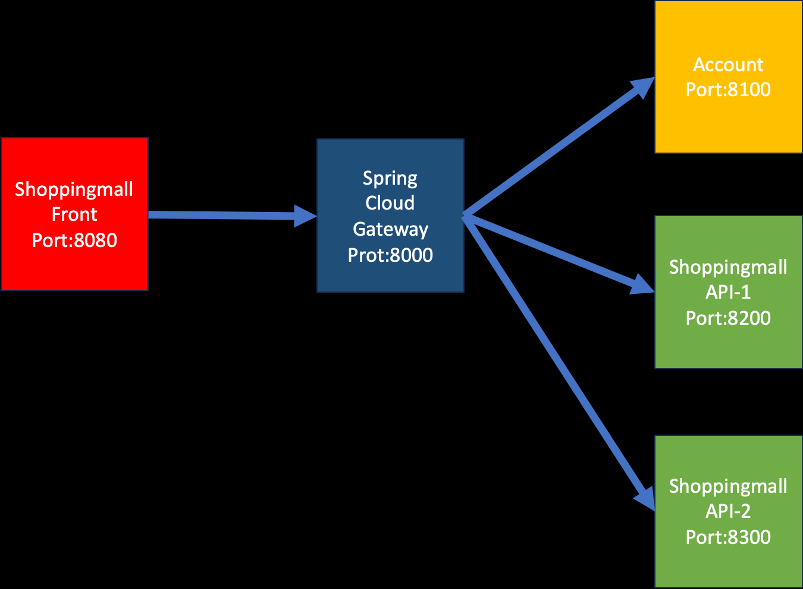

= 개발 환경

* 아래 개발 환경을 참고하여 구현합니다.

== 주요 Dependency
* Spring5
* Spring-data-jpa & QueryDSL5
* Mysql8

== 환경

=== Shoppingmall-Front
* port : 8080
* 쇼핑몰의 UI를 담당합니다.
* Spring mvc 기반의 `Thymeleaf`를 사용해서 구현합니다.

=== Spring Cloud Gateway
* port:8000
* Front 서버로부터 모든 API 요청의 진입점입니다.

=== Account
* 인증을 담당하는 서버입니다.
* Port:8100

=== Shoppingmall API
* 쇼핑몰 기능을 구현할 API 서버입니다.
* Port:8200, 8300 라운드로빈 방식으로 로드벨런싱 되어야 합니다.

